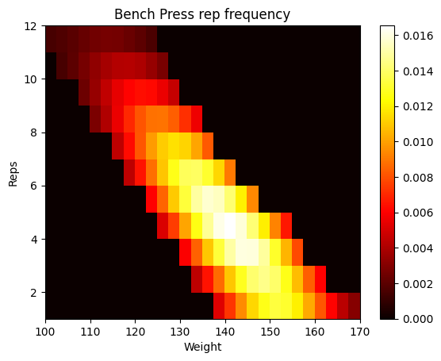

# Training

## Idea

Bench Press sample space
:-------------------------------------:


The project will create a sample space, as shown above, for (so far only powerlifting-oriented) exercises. From this space randomly generated training programs will be sampled in accordance with the principle of [progressive overload](https://en.wikipedia.org/wiki/Progressive_overload). This is achieved by automatically selecting advantageous areas of the sample space and assure total volume increase on a week-to-week basis - to be repeated periodically.  

In addition, training days may be classified into categories by their difficulty. The idea is that randomly generated training programs such as these will inject some much needed variation into a sometimes very repetitive sport. We see that the training programs will thus allow for structured training, while fully exploiting the good days for the most high-intensity training, while easier workouts may be reserved for worse days.

## Installation

Had some errors with python 3.10, so versions < 3.10 recommended.

## Run

Run programs from directory *src/*

*main.py* not yet implemented  
Run *main.py* as:  
```python3 main.py [-c config.yaml]```

and *log.py* as:  
```python3 log.py strong_log.csv [-c config.yaml] [-a]```  
***Note!***  
*The first argument, filename, will fetch data directly from '/data'.*  

### Args
Config `[-c]` can be provided as a yaml-file. Its items should correspond to attributes in config object **Exercise** in *src/config/exercises.py*, e.g.
```
squat:
  one_rm: 220.
  min_weight: 140.
  ...: ...
bench press:
  one_rm: 170.
  min_weight: 100.
  ...: ...
deadlift:
  one_rm: 245.
  min_weight: 180.
  ...: ...
```

Argument `[-a]` will tell the program to provide plots of the exercise sample spaces.


## Sample Dataset

You may freely use the following OneDrive link to download a sample-dataset 'strong.csv' if required. Place in */data*.
https://1drv.ms/x/s!AoUVajUQQW1fhpQqv1BRHAfRyQfb7g?e=0W5VsH


